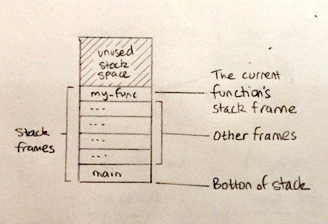
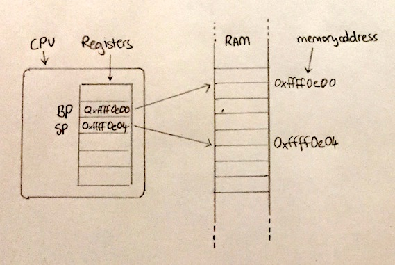
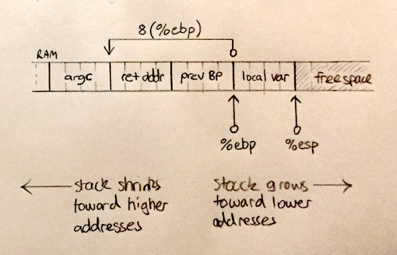

# Chapter 2: Receiving input from the command line

In this chapter we are going to build the equivalent of the following C program:

```c
int main(int argc, char *argv[]) {
    return argc;
}
```

Command line arguments are passed to a C or assembly language program via two parameters to the `main` function. The first parameter `argc` is an integer which will contain the count of arguments passed on the command line. The second parameter `argv` is an array containing the command-line argument strings.

In this example, we continue abusing the exit status value as a way to get output from our programs by returning the count of input arguments `argc` as the exit code.

Here is the assembly language version:

```x86att
.text

.globl _main
_main:
  # Set up the stack
  pushl %ebp
  movl %esp, %ebp

  # Load the value of argc into eax
  movl 8(%ebp), %eax

  # Return to calling code
  popl %ebp
  retl
```

Save this to a file called `cli_input.s`, then you can compile it by running:

```
$ gcc -m32 cli_input.s -o cli_input.out
```

Then execute and examine the exit status of the process to see if it worked:

```
$ ./cli_input.out; echo "The number of arguments was: $?"
```

You should see the output:

```
The number of arguments was: 1
```

Eh!? But we haven't passed any arguments!! It turns out there is always one argument in `argv` even if we haven't passed anything on the command line and that is the file path of the program itself. We will see what this looks like in a later chapter. Let's run it again and pass our own arguments.

```
$ ./cli_input.out 1 2 3; echo "The number of arguments was: $?"
The number of arguments was: 4
```

We now have three arguments in addition to the program path so we correctly see the number `4` as our exit status.

## Explanation

Let's break down the body of our new `main` function line-by-line.

```x86att
  # Set up the stack
  pushl %ebp
  movl %esp, %ebp
```

These two lines are very important. They are one half of the missing _stack management discipline_ alluded to in chapter 1, where we omitted them intentionally to keep our program as small as possible. From now on they will appear together at the beginning of all of our functions.

The important role they play is to set aside an area of what is known as _stack_ memory, where our function can store any local variables it might need while it is executing. The word _stack_ here refers to the classic data structure where you _push_ and _pop_ values on and off the top of a collection, and only ever operate on whichever value is currently at the top.



This area of memory dedicated to our function, within the _stack_, is referred to as a _stack frame_. Each function in a program has its own _stack frame_. Because functions can call other functions in a kind of chain, there may be many _stack frames_ on the _stack_ at any one time.



> ⚠️ TODO ^^^ the addresses are the wrong way around, SP will always be <= BP

The base-pointer (BP) and the stack-pointer (SP) are two registers dedicated to managing the stack. Their existence shows that the concept of having a _stack_ is not just a software mechanism, but an idea actually baked into the CPU hardware architecture.

BP holds the memory address relative to which our function will look up stack data it has access to. We will see an example of this shortly.

SP holds the memory address of the top of the stack. It is used to quickly find the next free memory when we need to push some data onto the stack.

The area of memory between the addresses in SP and BP contains all stack data local to the currently executing function.

So what do these two lines actually do?

```x86att
pushl %ebp
```

This line saves the address of the calling function's base pointer so it can be restored later when we return. `pushl` copies the current value of `%ebp` onto the top of the stack, then updates the address in `%esp` by the size of `%ebp`, so it continues to point to the top of the stack. Because we are in 32-bit mode the size of `%ebp` will be 4 bytes and so `%esp` will be changed by 4.

```x86att
  movl %esp, %ebp
```

This line copies the address stored in SP to BP, which effectively updates the base pointer to refer to the top of the stack. Having done this our function can now safely push any local data it might need.

Moving on to the actual body of our function:

```x86att
  # Load the value of argc into eax
  movl 8(%ebp), %eax
```

There is some new syntax here. Putting parentheses around `%ebp` accesses the value stored at the address held in BP. Prefixing with `8` offsets the address in BP by `+8`. So we are looking up a value in the stack relative to the base pointer.



You might notice something a little weird here: we are calculating a higher memory address to reach backwards in the stack to where calling code placed our function parameters. This is because stack grow downwards, not upwards as would be our intuition. This is just the way a processes memory is organised. Most of the time this does not matter, you can just visualise the stack growing up and shrinking down. The thing to remember is:

* Positive offsets reach back towards function arguments and
* Negative offsets reach forward to local variables

The reason we offset by `8` from the BP, is that inbetween the function parameter and BP there are two values:

* The return address - the address of the next instruction in calling code after it called our function (labelled `ret addr` in the diagram above)
* The previous address of BP - we saved this when we called `pushl %ebp` at beginning of our function

Now we reach the other half of the _stack management discipline_ - reseting the stack and returning:

```x86att
  # Return to calling code
  popl %ebp
  retl
```

Because we did not allocate any local variables, the value at the top of the stack is the previous address of the BP. We use `popl` to load it back into `%ebp` and increment `%esp` (remember addresses going up in value go down the stack).

Lastly, we use `retl` to return control to calling code. Given our new awareness of the stack, we can explain in more detail what this is doing. Having popped the previous value of BP off the stack, the data at the top is now the return address. What `ret` does is pop that address off of the stack and load it into the _instruction pointer_ register (IP).

> TODO final diagram showing we have returned and our now unallocated stack frame for main

---

## Key points

Here we are again. We have a small example and yet there are loads of interesting facts learned.

* Arguments from the command-line are passed to `main` as function parameters (`argc` and `argv` in C)
* The stack is a per-process area of main memory used to maintain local state in functions
* We maintain the stack using the base-pointer (BP) and stack-pointer (SP) registers
* When we enter a new function we set up a new stack frame by storing the previous value of BP then pointing it to the top of the stack
* We address values in the stack relative to the base-pointer (BP)
* Stack memory is arranged such that the bottom is at a high address and it grows towards lower addresses.
* Addresses of function parameters will have positive offsets and local variables will have negative offsets
* To address the first function parameter we have to offset by 8 to skip over the saved base-pointer and return instruction-pointer
* Before a function can return, the stack must be restored to the state it was in when the function was called

---

## Exercises

### 1) Don't count the program path

Update the example code to deduct 1 from the count in `argc`, so we only see the number of actual arguments we passed on the command line.

The `subl` instruction will let you subtract a value from another held in memory.
